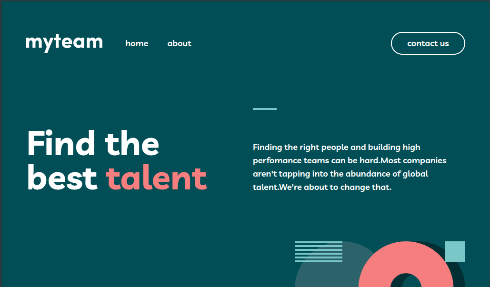
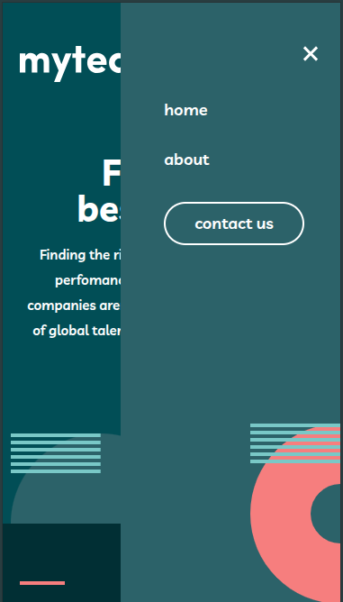
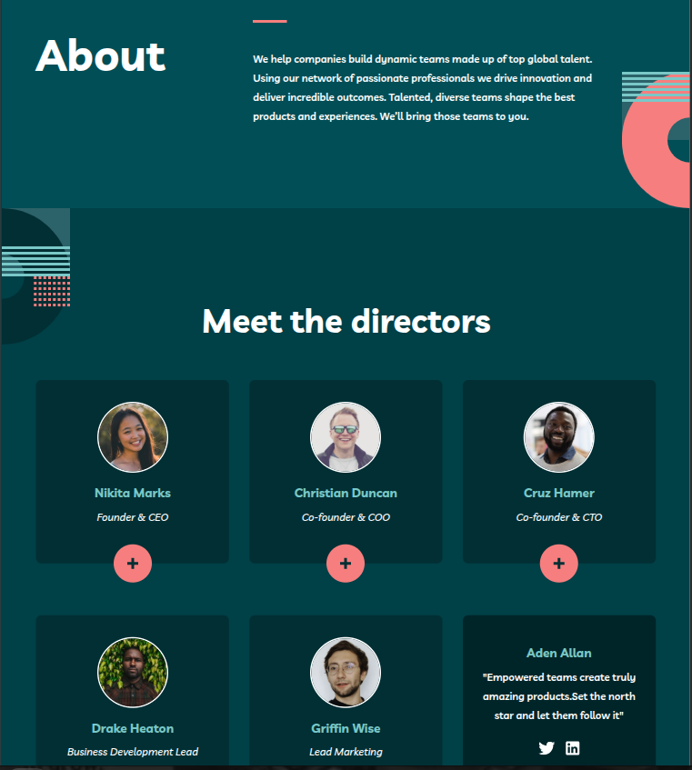
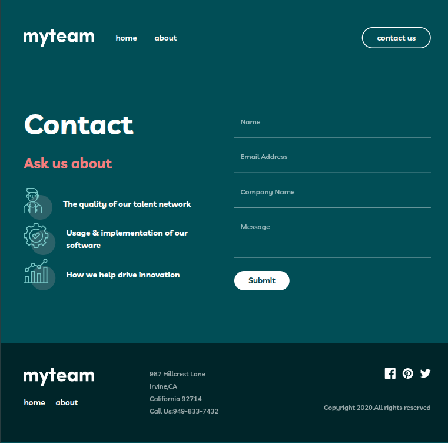
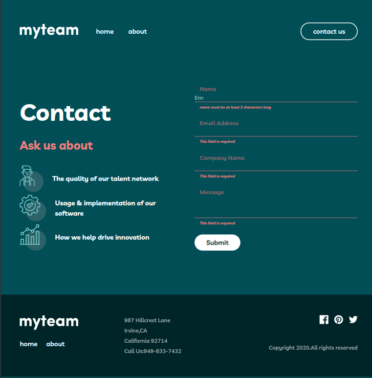

# myteam multi-page website

This is a solution to the **myteam multi-page website** challenge from [Frontend Mentor](https://www.frontendmentor.io).  
Frontend Mentor challenges help improve front-end skills by building realistic projects using professional designs.

---

## 📌 Overview

### The challenge

The goal of this challenge was to build a fully responsive **3-page website** based on provided designs.

Users should be able to:

- Navigate between the **Home**, **About**, and **Contact** pages
- See the correct content for each team member on the **About page** when the `+` icon is clicked
- Receive form validation error messages on the **Contact page** when:
  - The **Name**, **Email**, or **Message** fields are empty  
    → _"This field is required"_
  - The **Email address** is not correctly formatted  
    → _"Please use a valid email address"_
- View the optimal layout depending on their device’s screen size
- See hover and focus states for all interactive elements

---

### Screenshot

#### Home Page
Desktop view:
 

Mobile view (optional):
 

#### About Page
Desktop view with expanded card:

#### Contact Page
Desktop form:

Form error state (optional):

---

## 🛠️ Built with

- HTML5
- CSS3 (Flexbox & responsive layouts)
- Vanilla JavaScript
- Mobile-first workflow
- Frontend Mentor design system (colors, typography, spacing)

---

## ✨ What I learned

This project helped me strengthen my understanding of:

- Building **multi-page layouts** with consistent structure and styling
- Implementing **form validation** in vanilla JavaScript
- Managing **error states and live validation** without reloading the page
- Creating **responsive designs** across mobile, tablet, and desktop
- Following a **professional front-end workflow** using design files

Each challenge feels smoother than the last, and I’m getting more confident structuring my code and logic.

---

## 🚀 Continued development

In future projects, I want to focus more on:

- Improving accessibility (ARIA labels, keyboard navigation)
- Writing cleaner, more reusable JavaScript
- Adding subtle animations to enhance user experience

---

## 🔗 Links

- Live Site: https://myteam-website-emmanuel.netlify.app/
- Frontend Mentor Challenge: https://www.frontendmentor.io/challenges/myteam-multipage-website-mxlEauvW

---

## 🙌 Acknowledgements

Thanks to **Frontend Mentor** for providing high-quality designs that simulate real-world front-end projects.

I’m proud of how this project turned out and excited to keep improving with every challenge.
